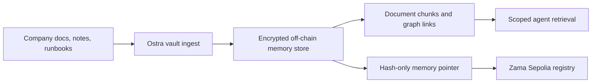

<p align="center">
  
</p>

<h1 align="center">Ostra Mem</h1>

<p align="center">
  Private memory infrastructure for company AI agents, with encrypted vault storage and Zama Sepolia hash anchoring.
</p>

<p align="center">
  
  
  
  
</p>


## What Is Ostra?

Ostra Mem is an Obsidian-like private knowledge layer for enterprise AI agents.

Companies can ingest policies, runbooks, notes, and internal documents into a workspace-scoped memory vault. Agents can then retrieve the context they are allowed to use through SDK, REST, or MCP tools. Raw company data stays off-chain; Zama Sepolia receives hash-only memory commitments for verifiable provenance.

Built from the original 0G-Mem codebase and redesigned for the Zama Developer Program.

## Why It Matters

AI agents need memory to be useful inside companies, but company memory is sensitive. Ostra separates memory usability from memory exposure:

| Need | Ostra Mem approach |
| --- | --- |
| Long-lived agent context | Structured memory records and document chunks |
| Large company knowledge bases | Vault ingest with document graphing |
| Data privacy | Encrypted local vault storage when configured |
| Agent access control | Workspace sessions and per-agent API keys |
| Auditability | Source, agent, and provenance visible in the dashboard |
| Verifiability | Hash-only anchors on Zama Sepolia |

## Product Surface

- **Dashboard**: operator view for memory maps, API keys, manual capture, and vault ingest.
- **SDK**: TypeScript client for local or hosted memory workflows.
- **REST API**: authenticated memory, vault, profile, and Zama status endpoints.
- **MCP server**: Streamable HTTP tools for agent runtimes and IDEs.
- **Contracts**: Zama Sepolia memory registry for private memory pointers.

## How It Works



Ostra does not put plaintext company memory on-chain. The chain only receives commitments such as memory hash, schema hash, and storage URI.

## Zama Integration

Ostra uses Zama Sepolia for verifiable private memory anchoring.

| Item | Value |
| --- | --- |
| Contract | `ConfidentialMemoryRegistry` |
| Network | Zama Sepolia compatible EVM testnet |
| Chain ID | `11155111` |
| Registry | `0xC5b79f3c8879B085f25c3ab90668A5ff462DAdb2` |
| Deployment metadata | `contracts/deployments/zama-memory-registry.json` |

The registry stores:

- agent identifier hash
- memory hash
- schema hash
- storage URI
- writer address and timestamp

## Repository Layout

```text
contracts/
  ConfidentialMemoryRegistry.sol
  deploy-zama.mjs
  deployments/zama-memory-registry.json

packages/
  api/       REST API and auth
  backend/   combined REST + MCP server
  mcp/       MCP tools and Streamable HTTP app
  sdk/       memory, vault, encrypted storage, Zama module
  web/       Ostra dashboard
```

## Quick Start

### Requirements

- Node.js `22.12.0` or newer
- npm
- Git

### Install

```bash
npm install
```

### Run The Backend

```bash
npm run backend:dev
```

Backend defaults:

```text
REST: http://127.0.0.1:8787
MCP:  http://127.0.0.1:8787/mcp
```

### Run The Web App

```bash
npm run web:dev
```

Open:

```text
http://127.0.0.1:5173
```

## Environment

Copy `.env.example` to `.env` and fill the values you need.

```env
ZAMA_RPC_URL=
ZAMA_PRIVATE_KEY=
ZAMA_EXPECTED_CHAIN_ID=11155111
ZAMA_MEMORY_REGISTRY_ADDRESS=0xC5b79f3c8879B085f25c3ab90668A5ff462DAdb2

OSTRA_MEM_APP_URL=http://127.0.0.1:5173
OSTRA_MEM_VAULT_KEY=
```

Generate a vault key:

```bash
node -e "console.log('base64:' + require('crypto').randomBytes(32).toString('base64'))"
```

Do not commit `.env`, `.ostra-mem/`, or `.zama-mem/`.

## SDK Example

```ts
import { OstraMem } from "@ostra-mem/sdk";

const mem = new OstraMem({
  storage: {
    provider: "file-encrypted",
    path: ".ostra-mem/memory.vault.json",
    vaultKey: process.env.OSTRA_MEM_VAULT_KEY
  },
  zama: {
    provider: "zama",
    rpcUrl: process.env.ZAMA_RPC_URL,
    privateKey: process.env.ZAMA_PRIVATE_KEY,
    memoryRegistryAddress: process.env.ZAMA_MEMORY_REGISTRY_ADDRESS
  }
});

const result = await mem.vault.ingestDocument({
  agentId: "enterprise-vault",
  title: "Security Runbook",
  text: "Escalate Sev-1 incidents through [[Security Policy]].",
  tags: ["security", "runbook"],
  anchor: true
});

console.log(result.document.hash, result.graph.nodes.length);
```

## API Client Example

Create an API key from the dashboard, then use it from an agent runtime.

```ts
import { OstraMemApiClient } from "@ostra-mem/sdk";

const client = new OstraMemApiClient({
  apiKey: process.env.OSTRA_MEM_API_KEY!,
  baseUrl: "http://127.0.0.1:8787"
});

await client.vault.ingestDocument({
  agentId: "enterprise-vault",
  title: "Incident Response Policy",
  text: markdown,
  anchor: true
});

const graph = await client.vault.graph({ agentId: "enterprise-vault" });
```

## REST API

Agent routes accept:

```text
Authorization: Bearer ogm_live_...
```

| Method | Route | Purpose |
| --- | --- | --- |
| `GET` | `/health` | Backend health |
| `POST` | `/auth/request-login` | Create dashboard login link |
| `GET` | `/auth/verify?token=...` | Verify dashboard session |
| `GET` | `/auth/me` | Current user and API keys |
| `POST` | `/api-keys` | Create agent API key |
| `DELETE` | `/api-keys/:id` | Revoke agent API key |
| `POST` | `/memory` | Add private memory |
| `GET` | `/memory?agentId=...` | Search/list memory |
| `POST` | `/vault/ingest` | Chunk and store enterprise document |
| `GET` | `/vault/graph?agentId=...` | Return document graph |
| `GET` | `/profile?agentId=...` | Return agent profile and context |
| `GET` | `/zama/status` | Show Zama anchoring config |

## MCP Tools

Run:

```bash
npm run mcp:http:dev
```

MCP endpoint:

```text
http://127.0.0.1:8788/mcp
```

Available tools:

| Tool | Purpose |
| --- | --- |
| `ostramem_add_memory` | Store structured private memory |
| `ostramem_get_profile` | Return profile plus recent memory |
| `ostramem_context_for_trade_plan` | Compatibility context retrieval |
| `ostramem_record_outcome` | Compatibility outcome memory |
| `ostramem_reflect_failure` | Create lessons from failures |
| `ostramem_ingest_document` | Ingest enterprise vault documents |
| `ostramem_vault_graph` | Return document/chunk graph |
| `ostramem_zama_status` | Show Zama anchoring status |

## Contracts

Compile:

```bash
npm run contracts:compile:zama
```

Deploy:

```bash
npm run contracts:deploy:zama
```

Required deployment env:

```env
ZAMA_RPC_URL=
ZAMA_PRIVATE_KEY=
```

## Verification

```bash
npm run build
npm test
npm run contracts:compile:zama
```

Recent local checks:

- backend build passes
- SDK storage, vault, and Zama tests pass
- dashboard manual memory save returns `201`
- dashboard vault ingest returns `201`

## Security Notes

- Ostra does not execute agent actions.
- Ostra does not custody funds.
- Raw company memory stays off-chain.
- API keys are stored as hashes and shown once.
- Use one API key per agent runtime for clean revocation.
- Zama private keys are only used by the backend when anchoring is enabled.

## Demo Flow

1. Open the dashboard.
2. Log in and create an API key.
3. Save a manual memory.
4. Ingest a company runbook into the vault.
5. Show the document graph.
6. Connect an SDK, REST, or MCP agent.
7. Anchor the memory hash on Zama Sepolia.

## License

Private hackathon project by Dive AI.
